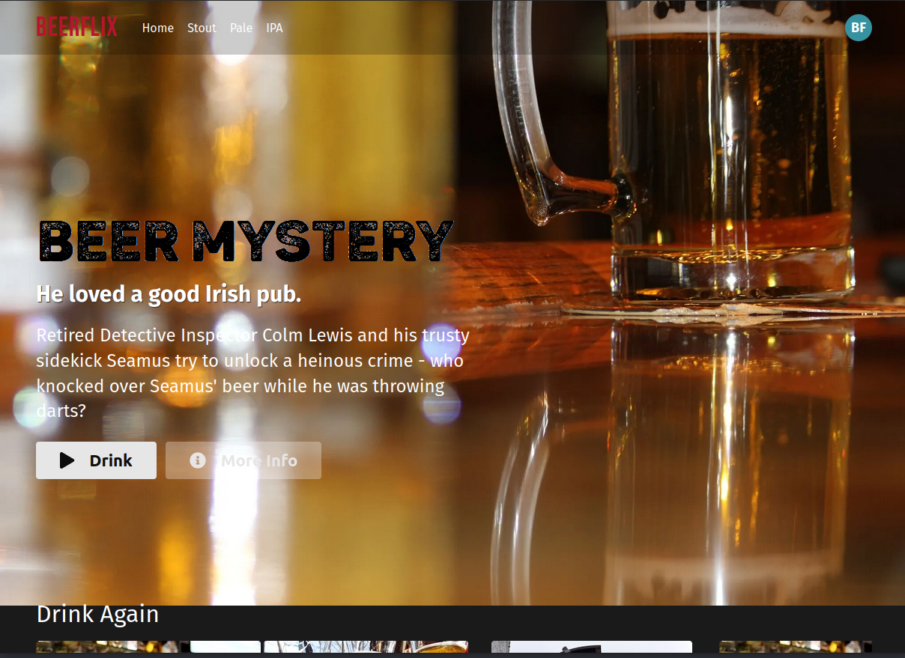

# BeerFlix

Refactor the HTML and CSS in `src/App.js` to use components.

* Your solution should have over 10 components
* Replace all hard-coded data with the static data below
* Deploy your app to a public URL

## Rubric

* [ ] - Deployed
* [ ] - Has over 10 meaningful components
* [ ] - No hard-coded data
* [ ] - Data is passed through the component hierarchy
